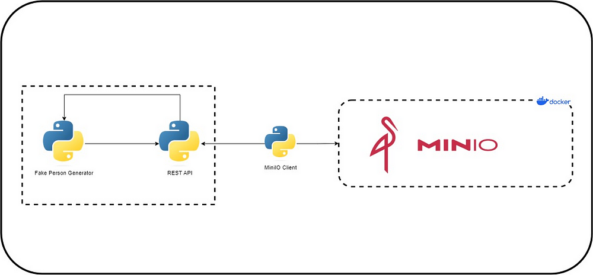

# End to End MinIO Project




# Introduction
In this example, we are using the Faker library to generate fake flight records. Subsequently, we create a REST endpoint that returns this data in JSON format. We then facilitate the transfer of the generated JSON file to a server using the MinIO Python API.

# Tools
1. MinIO
2. Docker & Docker Compose
3. Python


# Setup

1. Run docker-compose.yml file
```bash
cd EndtoEnd-MinIO-Example

pip install -r requirements.txt

docker compose up
```

  
## Lisans

[MIT](https://choosealicense.com/licenses/mit/)

  [](https://choosealicense.com/licenses/mit/)

